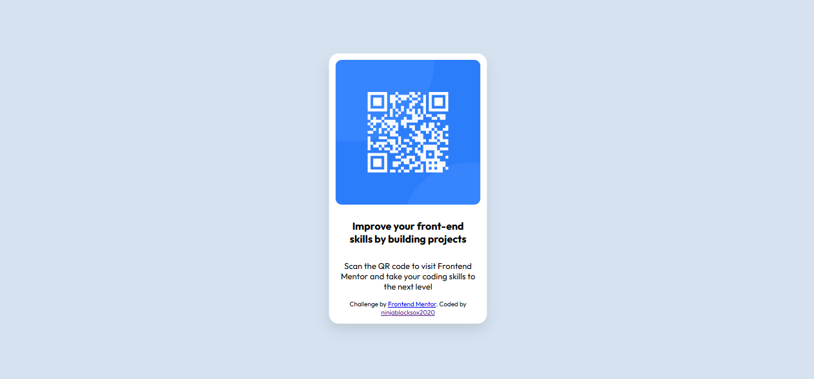

# Frontend Mentor - QR code component solution

This is a solution to the [QR code component challenge on Frontend Mentor](https://www.frontendmentor.io/challenges/qr-code-component-iux_sIO_H). Frontend Mentor challenges help you improve your coding skills by building realistic projects.

## Table of contents

- [Overview](#overview)
  - [Screenshot](#screenshot)
  - [Links](#links)
- [My process](#my-process)
  - [Built with](#built-with)
  - [What I learned](#what-i-learned)
  - [Continued development](#continued-development)
  - [Useful resources](#useful-resources)
- [Author](#author)

## Overview

This is my first front-end development project, replicated a QR code component.

### Screenshot

### Links

- Solution URL: [Add solution URL here](https://your-solution-url.com)
- Live Site URL: [Add live site URL here](https://your-live-site-url.com)

## My process

I chose to do this frontend mentor challenge as simply as possible. I wanted to just use HTML and vanilla CSS to see if I could replicate the QR-code component. I know there are other easier ways to do this, but I wanted to get better with positioning elements on the page with vanilla css so I chose to do it this way.

### Built with

- HTML
- CSS

### What I learned

A bit more about css positioning for elements

### Continued development

I want to redo the project using flexbox and grid to see how each method differs in difficulty.

### Useful resources

https://www.w3schools.com/
https://www.quackit.com/

## Author

- Frontend Mentor - https://www.frontendmentor.io/profile/ninjablacksox2020
